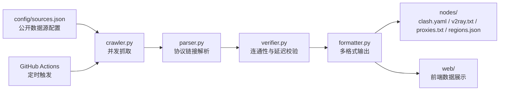

# ProxieHub

> 一个社区维护的免费代理与公开节点聚合器，**仅供网络协议学习、安全测试与隐私技术研究使用**。

[](https://github.com/MS33834/ProxieHub/actions/workflows/update-nodes.yml)
[](https://github.com/MS33834/ProxieHub/actions/workflows/deploy-web.yml)
[](https://github.com/MS33834/ProxieHub/actions/workflows/ci.yml)
[](LICENSE)
[](CHANGELOG.md)
[](VERSION)

[English](#english) | 中文

---

## ⚠️ 免责声明

1. 本项目仅用于**网络协议学习、安全测试和隐私技术研究**。
2. 所有节点与代理均来自**公开渠道**，我们**不保证**其可用性、安全性或隐私性。
3. 使用免费代理/节点时，**不要**登录敏感账户（银行、支付、社交媒体等）。
4. 请遵守所在国家或地区的法律法规。
5. 维护者不对因使用本项目而产生的任何直接或间接损失负责。

完整条款请见 [docs/index.md](docs/index.md)。

---

## 目录

- [项目简介](#项目简介)
- [核心特性](#核心特性)
- [架构概览](#架构概览)
- [快速开始](#快速开始)
- [数据源说明](#数据源说明)
- [输出文件说明](#输出文件说明)
- [部署说明](#部署说明)
- [项目结构](#项目结构)
- [环境变量](#环境变量)
- [贡献指南](#贡献指南)
- [社区与支持](#社区与支持)
- [路线图](#路线图)
- [更新日志](#更新日志)
- [许可证与致谢](#许可证与致谢)
- [English](#english)

---

## 项目简介

**ProxieHub** 通过自动化流水线聚合互联网上的免费代理和公开节点订阅，生成多种客户端可消费的订阅格式，并提供静态站点与 VitePress 文档，帮助用户快速找到适合自己的网络工具。

项目本身**不运营任何代理或 VPN 节点**，仅作为公开资源的“搬运工”与格式化工具。所有数据源、脚本和配置完全开源，欢迎社区审计与贡献。

---

## 核心特性

| 特性 | 说明 |
|---|---|
| 每日自动更新 | GitHub Actions 每日 UTC 02:00 自动抓取、解析、校验并发布节点。 |
| 多格式订阅 | 同时输出 Clash、V2Ray、HTTP/SOCKS5 三种常用订阅格式。 |
| 节点验证 | 可选的并发连通性与延迟探测，过滤明显失效的节点。 |
| 地区分组 | 生成 `regions.json` 按协议和地区统计节点（本地可开启）。 |
| 双仓库同步 | 订阅地址同时提供 GitHub 与 GitCode 入口，方便不同地区访问。 |
| 静态前端 | 基于 Next.js + Tailwind CSS 的展示站点，含统计、教程、数据源透明度。 |
| VitePress 文档 | 新手指南、客户端配置、数据源说明、自动化流程与 FAQ。 |
| 配置化数据源 | `config/sources.json` 集中管理来源，支持协议、频率、Base64 等元数据。 |

---

## 架构概览



流水线说明：

1. `crawler.py` 读取 `config/sources.json`，并发抓取各个公开源。
2. `parser.py` 从原始内容中提取 `ss://`、`vmess://`、`vless://`、`trojan://` 以及 `http(s)://`、`socks5://` 等链接。
3. `verifier.py` 在启用时对节点进行轻量级 TCP 连通与延迟测试。
4. `formatter.py` 将解析后的节点生成 Clash、V2Ray 与 HTTP/SOCKS5 格式，并可选输出地区分组。
5. GitHub Actions 每日定时运行完整流水线，并将结果提交到仓库与 GitCode 镜像。

---

## 快速开始

### 1. 直接订阅每日节点

| 格式 | GitHub Raw | GitCode Raw |
|---|---|---|
| Clash | `https://raw.githubusercontent.com/MS33834/ProxieHub/main/nodes/clash.yaml` | `https://api.gitcode.com/api/v5/repos/badhope/ProxieHub/raw/nodes/clash.yaml?ref=main` |
| V2Ray | `https://raw.githubusercontent.com/MS33834/ProxieHub/main/nodes/v2ray.txt` | `https://api.gitcode.com/api/v5/repos/badhope/ProxieHub/raw/nodes/v2ray.txt?ref=main` |
| HTTP/SOCKS5 | `https://raw.githubusercontent.com/MS33834/ProxieHub/main/nodes/proxies.txt` | `https://api.gitcode.com/api/v5/repos/badhope/ProxieHub/raw/nodes/proxies.txt?ref=main` |

将对应链接复制到客户端订阅地址栏，即可自动拉取每日更新的节点列表。

### 2. 本地运行

```bash
git clone https://github.com/MS33834/ProxieHub.git
cd ProxieHub
pip install -r requirements.txt
make test              # 运行单元测试
python scripts/update.py
```

启用节点验证（耗时更长，可过滤失效节点）：

```bash
PROXIEHUB_VERIFY_NODES=true python scripts/update.py --verify
```

启用地区分组（需要 GeoIP 数据支持）：

```bash
PROXIEHUB_GEO_ENABLED=true python scripts/update.py
```

### 3. 浏览前端站点

GitHub Pages 会自动部署 `web/` 目录构建的静态站点，页面包括：

- **首页**：项目概览、实时统计、FAQ。
- **订阅**：一键复制 Clash / V2Ray / HTTP(S)/SOCKS5 订阅链接。
- **数据源**：透明展示数据来源、协议、更新频率。
- **客户端**：各平台推荐客户端与配置教程。
- **工具生态**：桌面、移动、浏览器、路由器与命令行工具整理。
- **运行状态**：节点数量、代理池数量、协议分布与 Actions 状态。
- **路线图**：短期、中期与长期发展规划。
- **更新日志**：版本变更记录。
- **架构说明**：数据流、模块划分与文件路径。
- **关于**：项目原则、里程碑与重要声明。
- **社区**：贡献方式、行为准则与感谢名单。
- **参与贡献**：数据源模板、PR 流程与快速链接。
- **免责声明**：完整使用条款。

文档站点位于 `docs-site/`，使用 VitePress 构建，涵盖新手指南、FAQ、开发、部署与维护手册。

---

## 数据源说明

当前 `config/sources.json` 中配置的数据源分为两类：

### 免费节点订阅（free_node_sources）

主要来源为 GitHub Raw 上的公开订阅文件，部分为纯文本，部分为 Base64 编码。已启用的源约 18 个，覆盖以下协议：

| 协议 | 说明 |
|---|---|
| `vmess` | VMess 协议节点 |
| `vless` | VLESS 协议节点 |
| `ss` | Shadowsocks 节点 |
| `trojan` | Trojan 节点 |

代表性源类型包括：

- 每日更新的混合协议订阅（Base64）。
- 每 30 分钟更新的纯文本 vless/vmess 列表。
- 聚合型公开节点池（Base64 / 纯文本）。
- 大型按协议分类的节点列表（默认禁用，避免 CI 超时）。

### 免费代理列表（free_proxy_apis）

已启用 `proxifly/free-proxy-list`，每 5 分钟更新一次，协议包括 `http`、`https`、`socks4`、`socks5`。另有 gfpcom 系列大型代理列表默认关闭，可按需启用。

> 所有数据源均为公开可访问资源，项目不拥有、不运营这些节点。具体来源与限制请查看 `config/sources.json` 中的 `note` 字段。

---

## 输出文件说明

`nodes/` 目录下的文件由自动化流水线每日生成：

| 文件 | 格式 | 用途 |
|---|---|---|
| `clash.yaml` | Clash / Clash Verge / Stash 订阅 | 包含多种协议的 Clash 配置 |
| `v2ray.txt` | V2Ray / Nekoray / v2rayN / v2rayNG 订阅 | 每行一个节点分享链接 |
| `proxies.txt` | HTTP(S)/SOCKS 代理列表 | 每行一个 `host:port` |
| `regions.json` | JSON | 按协议与地区统计节点数量，供前端展示 |

> 由于公开节点具有时效性，文件内容会频繁变化，建议通过订阅链接直接使用，而不是手动复制内容。

---

## 部署说明

### GitHub Pages

仓库已配置 `deploy-web.yml`：当 `main` 分支推送或手动触发时，自动构建 `web/` 并部署到 GitHub Pages。

### GitHub Actions 定时更新

`.github/workflows/update-nodes.yml` 每日 UTC 02:00 运行：

```text
安装依赖 → 运行测试 → 执行 update.py → 提交节点更新 → 可选同步 GitCode
```

如需调整频率，可修改 workflow 文件中的 `cron` 表达式。

### GitCode 同步

如需同时推送到 GitCode：

1. 进入仓库 **Settings → Secrets and variables → Actions**。
2. 新建名为 `GITCODE_TOKEN` 的 repository secret，值为 GitCode 个人访问令牌。
3. 保存后，每次定时更新都会自动同步到 GitCode。

---

## 项目结构

```text
ProxieHub/
├── .github/              # Issue/PR/Release 模板与 Actions 工作流
│   ├── CODEOWNERS
│   ├── FUNDING.yml
│   ├── ISSUE_TEMPLATE/
│   ├── PULL_REQUEST_TEMPLATE.md
│   ├── release.yml
│   └── workflows/
├── config/
│   └── sources.json      # 数据源配置
├── docs/                 # 文档源文件（Markdown）
│   ├── development.md
│   ├── deployment.md
│   ├── maintenance.md
│   └── ...
├── docs-site/            # VitePress 文档站点
├── nodes/                # 自动生成的节点文件
├── scripts/              # 流水线脚本
│   ├── crawler.py
│   ├── parser.py
│   ├── verifier.py
│   ├── formatter.py
│   └── update.py
├── tests/                # 单元测试
├── tools/                # 各平台客户端推荐
├── web/                  # Next.js 静态站点
├── Makefile              # 常用开发命令
├── requirements.txt      # Python 依赖
├── CHANGELOG.md          # 更新日志
├── CONTRIBUTING.md       # 贡献指南
├── CODE_OF_CONDUCT.md    # 行为准则
├── SECURITY.md           # 安全策略
├── AUTHORS.md            # 贡献者名单
├── SUPPORT.md            # 支持与帮助
├── VERSION               # 当前版本
└── LICENSE
```

---

## 环境变量

| 变量 | 默认值 | 说明 |
|---|---|---|
| `PROXIEHUB_VERIFY_NODES` | `false` | 更新时是否启用 TCP 连通性校验 |
| `PROXIEHUB_MAX_NODES` | `500` | 输出中保留的最大节点链接数 |
| `PROXIEHUB_MAX_PROXIES` | `200` | 输出中保留的最大 HTTP/SOCKS5 代理数 |
| `PROXIEHUB_ALLOWED_HOSTS` | `raw.githubusercontent.com,gitcode.com,api.gitcode.com` | crawler 允许的额外域名 |
| `PROXIEHUB_CRAWL_WORKERS` | `min(16, enabled_sources)` | 并发源抓取数 |
| `PROXIEHUB_GEO_ENABLED` | `false` | 是否启用 GeoIP 地区分组 |
| `PROXIEHUB_GITHUB_OWNER` | `MS33834` | 前端链接使用的 GitHub owner |
| `PROXIEHUB_REPO_NAME` | `ProxieHub` | 前端链接使用的仓库名 |
| `PROXIEHUB_GITCODE_OWNER` | `badhope` | 前端链接使用的 GitCode owner |

---

## 贡献指南

- 发现数据源失效？使用 [数据源失效报告](https://github.com/MS33834/ProxieHub/issues/new?template=source_report.md) 模板提交 Issue。
- 想新增数据源？请先阅读 [CONTRIBUTING.md](CONTRIBUTING.md) 中的“如何提议新数据源”。
- 改进代码或文档？fork → branch → PR，确保 `make test` 与 `make lint` 通过。
- 安全问题？请通过 [SECURITY.md](SECURITY.md) 中的私密渠道报告，不要在公开 Issue 中披露。

---

## 社区与支持

- **GitHub Issues**：[报告问题、提交数据源建议](https://github.com/MS33834/ProxieHub/issues)
- **GitHub Pull Requests**：[提交代码与文档改进](https://github.com/MS33834/ProxieHub/pulls)
- **GitCode 镜像**：[国内访问入口](https://gitcode.com/badhope/ProxieHub)
- **支持手册**：[SUPPORT.md](SUPPORT.md)
- **贡献者名单**：[AUTHORS.md](AUTHORS.md)
- **行为准则**：[CODE_OF_CONDUCT.md](CODE_OF_CONDUCT.md)

---

## 路线图

### 短期（稳定性与数据源）

- [ ] 持续监控并清理失效的公开数据源。
- [ ] 优化 `verifier.py` 的并发与超时策略，降低 CI 耗时。
- [ ] 完善单元测试覆盖率，覆盖更多协议解析边界。

### 中期（验证策略与地区分组）

- [ ] 引入更细粒度的节点质量评分（延迟、丢包、协议支持）。
- [ ] 默认开启轻量地区识别，按国家/地区拆分订阅文件。
- [ ] 支持用户自定义过滤规则（协议、地区、延迟上限）。

### 长期（API 与社区）

- [ ] 提供稳定的 JSON API，供第三方客户端查询节点列表。
- [ ] 引入社区投票/反馈机制，标记高质量或已失效的数据源。
- [ ] 探索多语言文档与国际化前端。

---

## 更新日志

详见 [CHANGELOG.md](CHANGELOG.md)。

---

## 许可证与致谢

本项目基于 [MIT](LICENSE) 许可证开源。

感谢以下开源项目与社区维护者：

- 所有在 `config/sources.json` 中列出并公开分享节点的社区源维护者。
- [Next.js](https://nextjs.org/)、[Tailwind CSS](https://tailwindcss.com/)、[VitePress](https://vitepress.dev/) 等开源生态。
- 每一位提交 Issue、PR 和讨论的贡献者。

---

## English

**ProxieHub** is a community-curated aggregator of free proxy and public node lists, intended for network protocol learning, security testing, and privacy research only.

The project itself does **not** operate any proxy or VPN servers. It fetches publicly available sources, parses proxy links, optionally verifies connectivity, and generates multi-format subscription files (Clash, V2Ray, HTTP/SOCKS5). A Next.js static site and a VitePress documentation site are also included.

For usage, deployment, data sources, and contribution guidelines, please refer to the Chinese sections above or read [CONTRIBUTING.md](CONTRIBUTING.md), [SECURITY.md](SECURITY.md), and [CHANGELOG.md](CHANGELOG.md).

License: [MIT](LICENSE)
